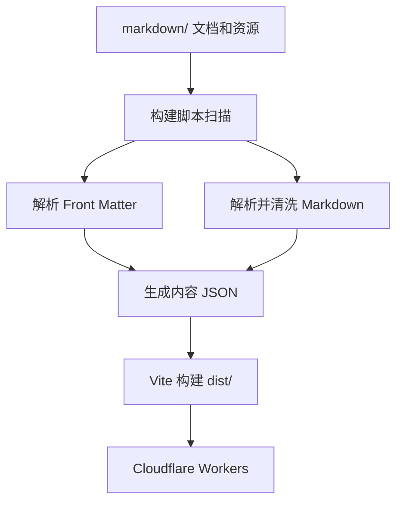

# FolderMark

一个轻量、无数据库、按文件夹组织内容的 Markdown 阅读站点。

把 Markdown 文档放入仓库的 `markdown/` 目录并推送到 GitHub，项目会在构建阶段自动扫描文件、解析内容、生成当前目录索引和稳定 URL，然后通过 Cloudflare Workers Static Assets 发布。

## 文档导航

- **README.md（本文）**：项目功能、工作方式和日常使用；
- **[FrontMatter.md](./FrontMatter.md)**：如何编写 Markdown、Front Matter、日期、ID、图片和目录首页；
- **[build.md](./build.md)**：如何构建并部署到 Cloudflare Workers。

## 适用场景

这个项目适合：

- 平时在本地文件夹中收集 Markdown 文档；
- 希望在电脑、平板或手机浏览器中阅读；
- 不想维护传统博客、数据库或 CMS；
- 文件名较长或包含中文，但希望 URL 简短稳定；
- 希望控制某些文档是否出现在索引中；
- 希望每次向 GitHub 推送内容后自动部署；
- 希望保留原来的文件夹分类方式。

它不是博客系统，也不试图提供后台编辑器、评论、用户账号或复杂导航。项目只专注于一件事：把一个 Markdown 文件夹变成简洁、稳定、便于阅读的网站。

## 核心功能

### 内容和程序分离

程序代码位于 `src/` 和 `scripts/`，内容全部位于：

```text
markdown/
```

日常使用时通常只需要修改 `markdown/`，不需要修改 JavaScript。

### 文件夹直接映射 URL

假设内容结构为：

```text
markdown/
├── article-a.md
└── soft/
    └── tool-a.md
```

如果两个文档的 ID 分别为 `article-a` 和 `tool-a`，URL 为：

```text
/article-a
/soft/tool-a
```

### 每个目录拥有独立索引

```text
/index
/soft/index
```

- `/index` 只列出 `markdown/` 当前层文档；
- `/soft/index` 只列出 `markdown/soft/` 当前层文档；
- 索引不会递归收集所有子目录内容。

### 每个目录可以有默认页

目录中的 `README.md` 是该目录默认页面：

```text
markdown/README.md       → /
markdown/soft/README.md  → /soft/
```

没有 `README.md` 时，对应目录 URL 显示为空白页。这是预期行为。

### 索引可见性和文档访问分离

Front Matter 中：

```yaml
cleanup: 1
```

表示文档进入当前目录索引。

如果没有 `cleanup`，或设为 `0`，文档不会出现在索引中；但只要有有效 `id`，仍可手工输入 URL 访问。

这适合：

- 尚未清洗完成的文档；
- 临时文档；
- 不希望列出但需要保留链接的材料。

`cleanup` 不是访问权限。公开部署后，知道 URL 的人仍然可以读取文档。

### 稳定 ID 路由

文档 URL 使用 Front Matter 中的 `id`，而不是文件名：

```yaml
id: 7f3a9c21
```

即使以后修改文件名或标题，URL 仍可保持不变。

### 标题自动回退

页面标题依次读取：

1. Front Matter 中的 `title`；
2. 正文第一个一级标题；
3. 文件名。

页面主标题居中，每 30 个 Unicode 字符强制换行。正文中的一级、二级和五级标题居中。

### 日期和网络文献引用

手写文档可以使用：

```yaml
time: 2026-6-23
```

页面显示：

```text
[2026-06-23]
```

网络保存文档可以使用：

```yaml
saved: "2026-06-23T11:24:52+08:00"
source: https://example.com/article
```

页面会在标题横线下方生成 GB/T 7714-2015 风格引用：

> 《文档标题》 [EB/OL]. [2026-06-23]. https://example.com/article.

字段和写法详见 [FrontMatter.md](./FrontMatter.md)。

### 重复 ID 自动编号

同一目录中出现重复 ID 时，会生成：

```text
/same-id/1
/same-id/2
```

基础地址 `/same-id` 自动跳转到 `/same-id/1`。

编号优先按照文件第一次提交到 GitHub 的时间排序。项目内置 GitHub Actions，将首次提交时间记录到：

```text
data/content-order.json
```

这样不同构建环境不会改变编号。

### 图片和附件

支持两种方式：

1. 在 Markdown 中使用 R2、S3 等对象存储的绝对 HTTPS 地址；
2. 把图片放在 `markdown/` 中并使用相对路径。

仓库内的非 `.md` 文件会在构建时复制到 `public/_files/`，相对链接会自动改写。

对于大量图片，推荐使用 Cloudflare R2。

### 安全渲染

项目支持常见 GitHub Flavored Markdown：

- 标题；
- 段落；
- 列表和任务列表；
- 链接；
- 图片；
- 引用；
- 代码块；
- 表格；
- 删除线；
- `<details>` 和 `<summary>`。

Markdown 转换后的 HTML 会经过白名单清洗。脚本标签、事件处理属性、`iframe` 和不安全协议不会保留。

## 工作原理



解析发生在构建阶段，而不是用户访问时。

每次部署会：

1. 遍历 `markdown/`；
2. 解析 Front Matter；
3. 生成标题、日期、引用和路由；
4. 生成每个目录的索引 JSON；
5. 转换并清洗 Markdown；
6. 复制本地图片和附件；
7. 由 Vite 打包到 `dist/`；
8. 由 Wrangler 上传到 Cloudflare。

浏览器访问页面时只读取预先生成的 JSON，不调用 GitHub API，也不会临时遍历仓库。

## 快速开始

### 环境要求

- Node.js 22.12 或更高版本；
- npm；
- Git。

### 安装

```bash
npm install
```

自动化环境建议：

```bash
npm ci
```

### 本地运行

```bash
npm run dev
```

项目自带两个通用演示文件：

```text
markdown/README.md
markdown/example.md
```

默认可以访问：

```text
/                 目录首页
/index            根目录索引
/getting-started  示例文档
```

### 换成自己的文档

删除通用演示：

```text
markdown/README.md
markdown/example.md
```

然后把自己的 Markdown 文件和子文件夹复制到：

```text
markdown/
```

一个最小普通文档如下：

```markdown
---
id: my-first-note
title: 我的第一篇文档
cleanup: 1
time: 2026-07-26
---

这里是正文。
```

访问：

```text
/my-first-note
```

完整写法见 [FrontMatter.md](./FrontMatter.md)。

### 运行测试

```bash
npm test
```

测试使用 `tests/fixtures/`，不会读取或修改你的正式 Markdown。

### 生产构建

```bash
npm run build
```

构建结果位于：

```text
dist/
```

本地预览：

```bash
npm run preview
```

### 部署

项目推荐部署到 Cloudflare Workers：

```bash
npm run deploy
```

也可以连接 GitHub，让 Cloudflare 在每次 Push 后自动构建。完整步骤见 [build.md](./build.md)。

## 常用 URL

假设：

```text
markdown/
├── README.md
├── note.md
└── soft/
    ├── README.md
    └── tool.md
```

其中 `note.md` 的 ID 为 `note-1`，`tool.md` 的 ID 为 `tool-1`：

| URL | 内容 |
| --- | --- |
| `/` | 根目录 `README.md` |
| `/index` | 根目录当前层索引 |
| `/note-1` | 根目录文档 |
| `/soft/` | `soft/README.md` |
| `/soft/index` | `soft` 当前层索引 |
| `/soft/tool-1` | `soft` 目录文档 |

## 日常使用流程

推荐的内容维护流程：

1. 在本地 Markdown 客户端中收集或编写文档；
2. 为文档添加 Front Matter；
3. 未清洗完成时使用 `cleanup: 0`；
4. 完成清洗后改为 `cleanup: 1`；
5. 图片上传至 R2，并把 Markdown 图片地址替换为 HTTPS URL；
6. 把文件放入合适的 `markdown/` 子目录；
7. 提交并推送到 GitHub；
8. 等待 Cloudflare 自动部署；
9. 访问该目录的 `/index` 或文档 ID URL。

## npm 命令

| 命令 | 作用 |
| --- | --- |
| `npm run content` | 扫描 Markdown，生成内容 JSON 和本地资源。 |
| `npm run content:order` | 更新重复 ID 的首次提交时间账本。 |
| `npm run dev` | 生成内容并启动开发服务器。 |
| `npm test` | 运行独立测试。 |
| `npm run build` | 构建生产版本到 `dist/`。 |
| `npm run preview` | 预览 `dist/`。 |
| `npm run deploy` | 构建并通过 Wrangler 部署。 |

## 项目结构

```text
.
├── .github/
│   └── workflows/
│       ├── test.yml
│       └── update-content-order.yml
├── data/
│   └── content-order.json
├── markdown/
│   ├── README.md
│   └── example.md
├── scripts/
│   ├── build-content.mjs
│   └── update-order-ledger.mjs
├── src/
│   ├── main.js
│   └── styles.css
├── tests/
│   ├── fixtures/
│   └── content.test.mjs
├── FrontMatter.md
├── README.md
├── build.md
├── LICENSE
├── index.html
├── package.json
├── vite.config.js
└── wrangler.jsonc
```

以下内容由构建自动生成，不要手工维护或提交：

```text
dist/
public/_content/
public/_files/
.wrangler/
node_modules/
```

## 自定义

### 站点名称

修改：

```text
src/main.js
index.html
```

`src/main.js` 中：

```js
const siteName = "FolderMark";
```

### 阅读样式

修改：

```text
src/styles.css
```

颜色变量位于文件开头：

```css
:root {
  --accent: #059b4c;
  --ink: #2a2926;
  --paper: #fffefa;
  --stage: #eeece6;
}
```

### 标题换行长度

在 `src/main.js` 中调整：

```js
function appendWrappedText(element, value, lineLength = 30)
```

## 使用限制

- 没有全文搜索；
- 没有账号和访问权限系统；
- 没有后台编辑器；
- 不自动生成跨目录总目录；
- 不执行 Markdown 中的自定义 JavaScript；
- `cleanup: 0` 不能保护私密内容；
- 大量本地图片会增加 Git 仓库与部署资源数量。

这些限制使项目能够保持简单、稳定，并以纯静态资源运行。

## 常见问题

### 根地址为什么是空白？

根目录没有 `markdown/README.md`。访问 `/index` 查看根目录索引。

### 文档为什么没有进入索引？

检查：

- 是否位于当前目录；
- 是否有有效 `id`；
- `cleanup` 是否为数值 `1` 或字符串 `"1"`；
- Front Matter 是否位于文件开头；
- 构建日志是否有 YAML 或 ID 警告。

### 文档隐藏后为什么仍能打开？

`cleanup` 只控制是否进入索引，不控制访问权限。

### 修改后为什么没有变化？

检查 GitHub 是否收到提交、Cloudflare 最新构建是否成功，并执行一次浏览器强制刷新。

### 可以使用私有 GitHub 仓库吗？

可以，只要 Cloudflare GitHub 应用获得仓库权限。但部署后的 Worker 是否公开，取决于 Cloudflare 的访问控制配置。

## 安全说明

- 公开仓库中的 Markdown 可以直接从 GitHub 读取；
- 公开站点中的隐藏文档可能通过 ID URL 访问；
- 外部图片服务可能收到访问者的网络请求信息；
- 真正的私有访问应使用 Cloudflare Access 或其他认证系统；
- 不要在 Markdown 或 Front Matter 中写入密码、Token、Cookie 或个人隐私。

## 参与贡献

提交代码前运行：

```bash
npm ci
npm test
npm run build
npx wrangler deploy --dry-run
```

不要把个人内容、`dist/`、`node_modules/` 或自动生成的 `public/_content/` 提交到功能型 Pull Request。

## License

[MIT](./LICENSE)
